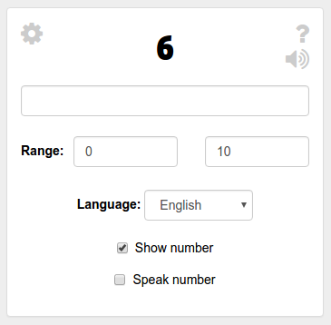

# Number-writing-trainer

This app helps to learn how to write numerals in different languages. Two options could used:

 - show number
 - 'read' number (if this feature and selected language are supported by browser)



Demo: [http://pavelmakhov.com/number-writing-trainer/#/](http://pavelmakhov.com/number-writing-trainer/#/)

# Features

  - Select range;
  - Supported languages:
    - for showing number - English, French, Spanish and Portuguese;
    - for 'reading' number depends on the browser;

# Read number feature - speech synthesis

Here you can read more about this feature: [developers.google.com](https://developers.google.com/web/updates/2014/01/Web-apps-that-talk-Introduction-to-the-Speech-Synthesis-API)

# Installation

Play with it locally or contribute/improve it:

```
git clone https://github.com/streetturtle/number-writing-trainer.git
cd ./number-writing-trainer
npm start
```  
# Licence

The MIT License (MIT)
Copyright (c) 2016 Pavel Makhov
